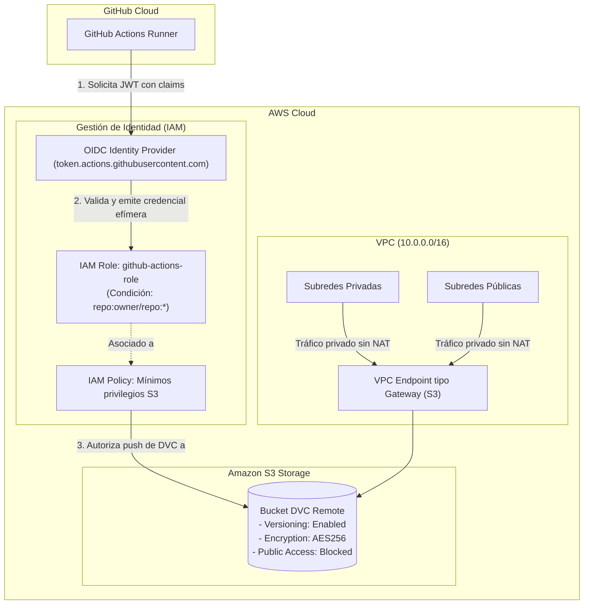

# Infraestructura AWS con Terraform (Frente 9)

Este directorio contiene la definición declarativa en **Terraform** de la infraestructura cloud en AWS requerida para el **Frente 9 (Infraestructura — Terraform, 10 pts)** del proyecto *Dataset Quality & Versioning*.

Aprovisiona la red segura, el almacenamiento versionado para el remote de DVC en producción y la identidad federada para CI/CD sin comprometer secretos.

---

## Arquitectura y Capas Modulares

La solución se divide en tres capas desacopladas dentro de `modules/`:

```
terraform/
├── versions.tf                    # Versión de Terraform (>= 1.5.0) y AWS Provider (~> 5.0)
├── variables.tf                   # Variables raíz parametrizables
├── main.tf                        # Orquestación raíz conectando los 3 módulos
├── outputs.tf                     # Identificadores exportados (VPC, Bucket, Rol OIDC)
├── terraform.tfvars.example       # Plantilla de variables (cero secretos, compuerta M2)
└── modules/
    ├── networking/                # Capa 1: Red VPC y S3 Gateway Endpoint
    ├── s3/                        # Capa 2: Bucket S3 versionado e inmutable
    └── oidc_github/               # Capa 3: Federación IAM OIDC con GitHub Actions
```

### 1. Capa 1: Red y VPC Endpoint (`modules/networking`)
* **VPC dedicada** con subredes públicas y privadas distribuidas en zonas de disponibilidad redundantes.
* **VPC Endpoint tipo Gateway para S3 (`aws_vpc_endpoint`)**: Asociado directamente a las tablas de ruteo públicas y privadas. Permite que cualquier recurso dentro de la VPC interactúe con los buckets de S3 a través del backbone privado de AWS, eliminando la necesidad de atravesar la internet pública y evitando los sobrecostes de un NAT Gateway.

### 2. Capa 2: Storage S3 Versionado (`modules/s3`)
* **Bucket S3 para remote DVC de producción**: Destino del dataset versionado una vez que supera la compuerta de calidad.
* **Versionamiento habilitado (`aws_s3_bucket_versioning`)**: Garantiza inmutabilidad y protección contra sobreescrituras accidentales, habilitando la reproducibilidad histórica exigida por DVC.
* **Cifrado en reposo (`aws_s3_bucket_server_side_encryption_configuration`)**: Cifrado automático con SSE-S3 (`AES256`).
* **Bloqueo estricto de acceso público (`aws_s3_bucket_public_access_block`)**: Todos los flags de acceso público activados (`block_public_acls`, `block_public_policy`, etc.).
* **Gestión de ciclo de vida (`aws_s3_bucket_lifecycle_configuration`)**: Expiración de versiones no actuales tras 90 días y cancelación automática de uploads multipart incompletos tras 7 días.

### 3. Capa 3: Identidad y OIDC (`modules/oidc_github`)
* **Cumplimiento estricto de la Compuerta M2 (Cero secretos en Git)**: En lugar de crear un usuario IAM con llaves estáticas (`AWS_ACCESS_KEY_ID` / `AWS_SECRET_ACCESS_KEY`) que podrían filtrarse en commits, se configura un proveedor **OpenID Connect (OIDC)** con GitHub Actions (`https://token.actions.githubusercontent.com`).
* **Rol IAM con Trust Policy condicionada**: El rol únicamente puede ser asumido mediante `sts:AssumeRoleWithWebIdentity` por ejecuciones de GitHub Actions originadas en el repositorio configurado (`repo:stephy0410/ruta-al-dataset-v1:*`).
* **Mínimos privilegios**: La política adjunta al rol autoriza exclusivamente las operaciones necesarias para DVC (`ListBucket`, `GetObject`, `PutObject`, `DeleteObject`) sobre el bucket del proyecto.

---

## Diagrama de Arquitectura



---

## Validación de la Infraestructura

De acuerdo con las reglas de evaluación de la rúbrica:
> *El frente 9 se califica sobre la corrección del código y su validación (`terraform validate`), no sobre el despliegue.*

### 1. Formato de código
Verifica que todos los archivos cumplan con el estándar canónico de Terraform:
```bash
terraform fmt -check
```

### 2. Inicialización sin backend remoto
Inicializa los providers y módulos locales sin necesidad de credenciales de AWS activas ni backend remoto:
```bash
terraform init -backend=false
```

### 3. Validación estricta
Verifica la sintaxis, compatibilidad de argumentos y coherencia de tipos en todos los módulos:
```bash
terraform validate
```

---

## Despliegue en AWS (Opcional si se cuenta con cuenta activa)

Para aplicar los cambios en un entorno real de AWS:

1. Configurar credenciales locales de AWS (`aws configure` o variables `AWS_PROFILE` / `AWS_REGION`).
2. Copiar el archivo de variables:
   ```bash
   cp terraform.tfvars.example terraform.tfvars
   # Editar con el nombre real de bucket y repositorio deseados
   ```
3. Ejecutar el plan y despliegue:
   ```bash
   terraform init
   terraform plan -out=tfplan
   terraform apply tfplan
   ```
4. Los outputs mostrarán el `github_actions_role_arn` y `s3_bucket_name` para configurar los secretos de GitHub Actions y el remote de DVC.

