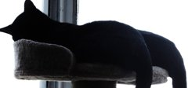
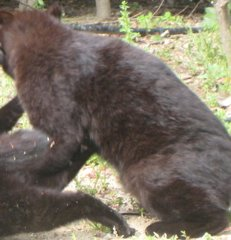
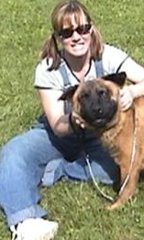

# Evaluación final en test y análisis de errores — F6 (T15, T16)

Evaluación **única** del candidato de [`selection.json`](selection.json) (r10, run `9f9b62c202f0446a8a4b411a10321eff`) sobre los **145 recortes de `test`** del manifiesto congelado `m-0.1.3-s42-1`. Criterios 4.1–4.4.

Resultados completos en [`reports/evaluation/9f9b62c202f0446a8a4b411a10321eff/`](../reports/evaluation/9f9b62c202f0446a8a4b411a10321eff/):
- `predictions_test.csv`: una fila por recorte con `crop_id`, clase real, clase predicha y probabilidades;
- `metrics.json`: métricas y procedencia;
- `errors.json`: todos los errores y 12 aciertos repartidos.

## Protocolo y cronología (4.1)

| Paso | Commit / fecha | Evidencia |
|---|---|---|
| Clases fijadas | `219fed3` — 25 sep 21:45 (-06:00) | [clases.md](clases.md) |
| Manifiesto congelado | tag `p3-manifiesto-congelado` (`567ea9d`) — 26 sep 17:50 | [manifiesto.md](manifiesto.md) |
| Barrido de 12 corridas | 26 sep 19:55–21:38 | [corridas.md](corridas.md); ninguna métrica de test en MLflow |
| Selección por validación | `6bd9101` — 26 sep 21:40 | `selection.json` (`checkpoint_sha256 e4acca42…`) |
| **Evaluación en test** | código `a7ec1dc`; `evaluated_at` **2026-09-28T02:25:07Z** (27 sep 20:25 -06:00); resultados en `3792f93` | `metrics.json` guarda `selection_commit`, `selection_sha256`, `checkpoint_sha256`, `manifest_hash`, `crops_jsonl_sha256` y `code_commit` |

`scripts/final_evaluation.py` se niega a correr sin árbol limpio, sin `selection.json` versionado, con otro manifiesto, otros recortes u otro checkpoint (`p3/eval/evaluate.py`), y **se niega a correr una segunda vez**. El test no se usó para entrenar, aumentar datos, hacer early stopping, fijar umbrales ni elegir el modelo. El modo `--audit` vuelve a predecir y compara sin escribir: **`audit_matches: true`**.

## Métricas (4.2, 4.3)

| Métrica | Valor |
|---|---|
| Recortes de test | 145 (cat 32, dog 38, person 75) |
| **Accuracy top-1** | **142 / 145 = 0.9793103448275862** |
| Meta ≥ 0.85 (sin redondear) | **Cumplida** |
| F1 macro | 0.9743519475145314 |
| Baseline de clase mayoritaria (`person`, mismo test) | 75 / 145 = 0.5172 |

**Matriz de confusión** (filas = clase real, columnas = clase predicha):

| real \ pred | cat | dog | person | Total |
|---|---:|---:|---:|---:|
| **cat** | **30** | 2 | 0 | 32 |
| **dog** | 0 | **38** | 0 | 38 |
| **person** | 0 | 1 | **74** | 75 |
| Total | 30 | 41 | 74 | 145 |

**Por clase:**

| Clase | Precisión | Recall | F1 | Support |
|---|---:|---:|---:|---:|
| cat | 1.0000 | 0.9375 | 0.9677 | 32 |
| dog | 0.9268 | 1.0000 | 0.9620 | 38 |
| person | 1.0000 | 0.9867 | 0.9933 | 75 |

**Recalculado de forma independiente** desde `predictions_test.csv`, con código aparte de `p3.eval.metrics`: misma matriz, misma accuracy y mismo F1 macro que `metrics.json`. Los 145 `crop_id` son exactamente los de `test` del manifiesto, y la clase real de cada uno coincide con la del manifiesto.

## ¿El 97.9 % oculta una clase débil? (4.4)

No. El accuracy supera por mucho al baseline de contestar siempre `person` (51.7 %), así que no se explica por el desbalance. Ninguna clase tiene recall bajo: la más baja es **cat, con 0.9375** (30 de 32), y el F1 macro (0.974) está a menos de 0.5 puntos del accuracy.

**Par más confundido:** `cat → dog` (2 casos). **`dog` es la única clase con falsos positivos**: los 3 errores se predijeron como `dog`.

## Los 3 errores

| Recorte | Real | Predicho | Prob. | Lectura |
|---|---|---|---:|---|
|  `0.1.3:a1574` | cat | dog | 0.677 | Gato negro a contraluz, en silueta y sin cara visible. El modelo duda (68 %) |
|  `0.1.3:a1656` | cat | dog | 0.890 | Animal oscuro y peludo de espaldas, borroso. Caso ambiguo |
|  `0.1.3:a579` | person | dog | 0.999 | La caja es de la **persona**, pero el recorte tiene un **perro grande** en sus brazos. El modelo reconoce lo que domina el recorte |

**Limitación que muestran los errores:**
- **Objetos encimados:** el recorte de una caja incluye lo que se le cruza, y a579 lo confirma.
- **Gatos oscuros, sin rostro o a contraluz:** son los casos que el modelo confunde con `dog`.

Los dos casos se deben declarar en la tarjeta del modelo (F7).

Los ejemplos navegables para la página Evaluation (F9) están en `errors.json`: `crop_id`, `crop_path` relativo a `data/crops/0.1.3/`, real, predicho y probabilidad. Todos vienen de `test`.

## Reproducir o auditar

```bash
cd Proyecto3
../Proyecto2/.venv/Scripts/dvc pull data/manifests/m-0.1.3-s42-1.dvc mlflow_snapshot.dvc
# recortes: scripts/generate_crops.py (crops.jsonl debe dar d3d61f35…)
.venv/Scripts/python scripts/final_evaluation.py --audit   # recalcula y compara; no escribe
```
