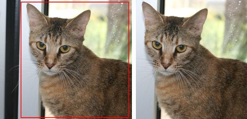
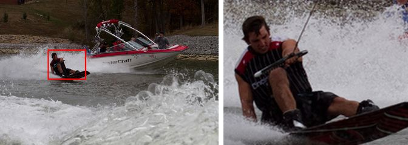
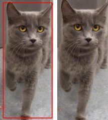
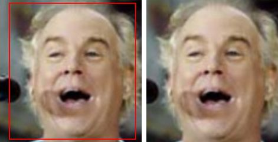
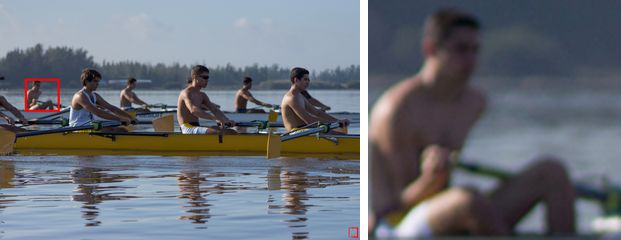
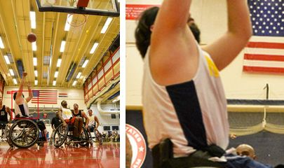
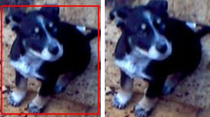
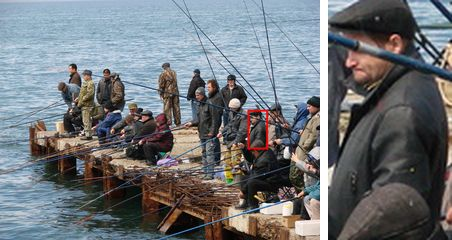
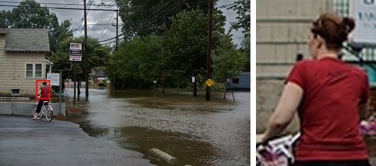
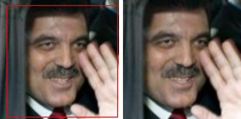

# Verificación de recortes — release 0.1.3 (F2 T07)

Comprobación de que cada recorte es la caja COCO correcta, con la etiqueta correcta (criterio 1.2). Se genera con:

```bash
cd Proyecto2
PYTHONPATH=../Proyecto3/src .venv/Scripts/python ../Proyecto3/scripts/generate_crops.py --release 0.1.3 --profile <perfil-aws>
cd ../Proyecto3
.venv/Scripts/python scripts/verificar_recortes.py --release 0.1.3 --n 10 --seed 7
```

## 1. Verificación automática de todos los recortes

`scripts/verificar_recortes.py` recorre los **1459** recortes de `data/crops/0.1.3/crops.jsonl` y, para cada uno, comprueba contra `Proyecto2/data/raw` (misma huella que el release):

- la anotación existe en el COCO con la misma `image_id`, `category_id`, nombre de categoría, `file_name` y bbox;
- el PNG es **pixel a pixel** `original.crop(crop_box_xyxy)`.

Resultado (25 sep 2026): `1459 recortes verificados contra el COCO y los pixeles del original`.

Dos generaciones seguidas producen los mismos bytes: hash agregado de todos los archivos de `data/crops/0.1.3/` = `919329b85c86…` en ambas.

## 2. Revisión visual de 10 recortes al azar

Muestra con semilla 7. Cada miniatura tiene el original con la caja en rojo a la izquierda y el recorte a la derecha.

| `crop_id` | Imagen (`image_id`) | Etiqueta | `bbox_xywh` | ¿Correcto? | Observación |
|---|---|---|---|---|---|
| `0.1.3:a1685` | 1632 | cat | [160, 13, 841, 903] | ✅ | Gato de frente; la caja cubre cabeza y cuerpo |
| `0.1.3:a1321` | 1055 | person | [223, 233, 180, 142] | ✅ | Persona haciendo wakeboard detrás de una lancha |
| `0.1.3:a359` | 294 | cat | [7, 6, 123, 291] | ✅ | Gato gris de cuerpo entero |
| `0.1.3:a872` | 807 | person | [16, 5, 229, 246] | ✅ | Rostro en primer plano |
| `0.1.3:a1102` | 940 | person | [71, 224, 98, 93] | ✅ | Remero lejano y desenfocado: caja pequeña pero bien etiquetada |
| `0.1.3:a1152` | 950 | person | [71, 553, 162, 172] | ✅ | Jugador de básquetbol en silla lanzando; la caja roja apenas se ve sobre el piso rojo. La caja cubre el torso y los brazos, no el cuerpo completo (anotación de P1, no un error del recorte) |
| `0.1.3:a638` | 572 | dog | [1, 7, 128, 143] | ✅ | Cachorro blanco y negro |
| `0.1.3:a1199` | 973 | person | [792, 351, 65, 126] | ✅ | Pescador en un muelle con mucha gente; caja pequeña |
| `0.1.3:a2032` | 2002 | person | [147, 328, 57, 79] | ✅ | Ciclista lejana |
| `0.1.3:a734` | 668 | person | [14, 11, 239, 241] | ✅ | Rostro en primer plano |

**Resultado: 10 de 10 recortes corresponden a su caja y a su etiqueta.** Revisión hecha por el agente de Diego sobre las miniaturas; la puede repetir cualquiera con el comando de arriba.

Observación para F4/F6: varios recortes de `person` son sujetos pequeños y lejanos (a1102, a1199, a2032), coherente con el 10.9 % de cajas diminutas que reporta P2. Se conservan por la regla de [clases.md](clases.md); conviene revisar el recall de `person` en la evaluación.

## Miniaturas

| | |
|---|---|
|  |  |
|  |  |
|  |  |
|  |  |
|  |  |
